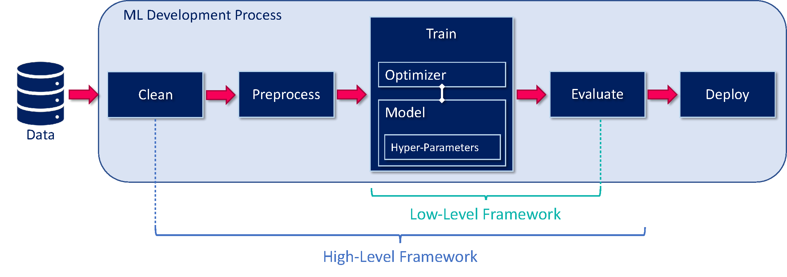

# Whitepaper-Framework-Selection
This repository contains additional material for the whitepaper about the AutoML framework selection process in the AutoQML project

### This repo contains
- The [Whitepaper](Bringing_Quantum_Algorithms_to_Automated_Machine_Learning.pdf) itself
- The [AutoML framework candidate list](doc/AutoML-Framework-Overview.xlsx) with the decision features and rankings
- The [interview questionnaire](doc/Interviews/Questionnair_Framework-Use-Case-Study.pdf) for the use-case study (made with MS Forms)
- The [interview results](doc/Interviews/) in an excel list (in German)
