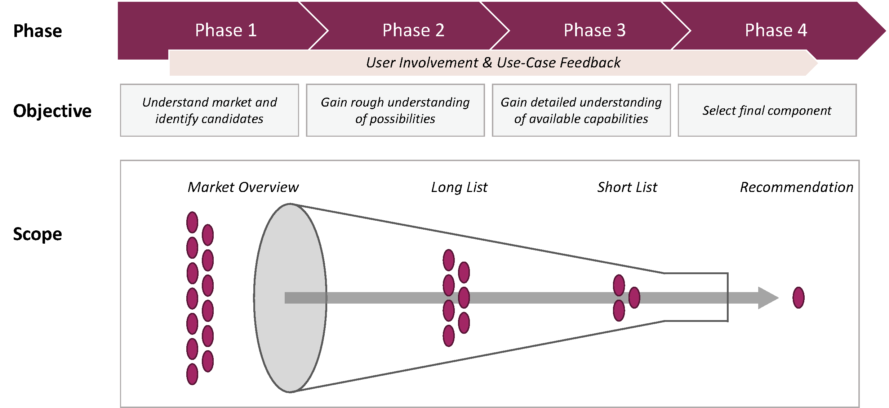

# *Whitepaper* Bringing Quantum Algorithms to Automated Machine Learning
This repository contains the whitepaper "Bringing Quantum Algorithms to Automated Machine Learning" and supplementary material.
The publication can also be accessed via arXiv: [https://arxiv.org/abs/2310.04238](https://arxiv.org/abs/2310.04238)

#### Acknowledgement
This work was created in the context of the AutoQML project, funded by the Federal Ministry
for Economic Affairs and Climate Action of Germany. \
The project website can be found at [this URL](https://www.autoqml.ai/en).

### This repo contains
- The [Whitepaper](Bringing_Quantum_Algorithms_to_Automated_Machine_Learning.pdf) itself
- The [AutoML framework candidate list](doc/AutoML-Framework-Overview.xlsx) with the decision features and rankings
- The [interview questionnaire](doc/Interviews/Questionnair_Framework-Use-Case-Study.pdf) for the use-case study (made with MS Forms)
- The [interview results](doc/Interviews/) in an excel list (in German)

### Abstract
Quantum Computing (QC) is becoming an increasingly promising technology for modern
computation, especially in the field of data driven approaches like simulation and
machine learning. With the high momentum of research and development of new hardand
software, QC holds a big promise in redefining many state-of-the-art approaches in
computation today.

On the other hand, the nowadays well-established field of machine learning (ML) faces
challenges like the discrepancy of demand by industry and availability of ML experts,
reproducibility, and efficiency in prototyping. To overcome some of these issues, several
frameworks have been created for automating the process of pipeline construction, data
preprocessing, model training and hyperparameter optimization (HPO), many of them
open source. In most cases, these Automated Machine Learning (AutoML) frameworks
implement a fixed subset of known approaches and algorithms, or encapsulate an established
ML backend, that defines the available algorithms.

This work describes the selection approach and analysis of existing AutoML frameworks
regarding their capability of a) solving a set of industrial use-cases with different ML
problem types and b) incorporating Quantum Machine Learning (QML) algorithms into
this automated solving approach. For that, available open-source tools are condensed into
a market overview and suitable frameworks are selected on a multi-phase, multi-criteria
approach considering software selection aspects (*Middendorf et al.*), as well as in terms of the technical
perspective of AutoML (*Hutter et al.*, *Zöller et al.*).

The requirements for framework selection are divided into hard and soft criteria regarding
their software and ML attributes. Additionally, a classification of AutoML frameworks is
made into high- and low-level types inspired by the findings of (*Zöller et al.*). Finally, we select Ray
and AutoGluon as the suitable low- and high-level frameworks respectively, because they
best fulfil the requirements and got the best feedback from our use-case study.
Based on this work, we will build QC specific pipeline steps and decision characteristics for
hardware and software constraints into these frameworks to enable them for Automatic
Quantum Machine Learning (AutoQML).

